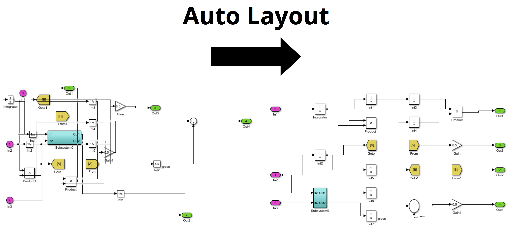

# Auto Layout Tool

Modeling operations often perturb a model's layout. Layout readjustment is usually needed, and represents a tedious activity if performed manually. Although achieving a proper layout of a Simulink model is deemed very important, there does not exist a comprehensive commercial automatic layout tool for Simulink models.

The Auto Layout Tool resizes models' blocks based on number of inputs and outputs, and organizes the signal lines such that the number of crossings is minimized. Auto Layout Tool can leverage three different layout approaches:

1. "Graphviz", a third-party open source tool for drawing graphs
1. Matlab’s built-in "GraphPlot" layout capability
1. An in-house "DepthBased" method

*Approaches 1) and 3) can be utilized on any version of Matlab/Simulink, while approach 2) only works on R2015b+.*

## User Guide
For installation and other information, please see the [User Guide](doc/AutoLayout_UserGuide.pdf).

This tool is also available for download on the [Matlab Central File Exchange](https://www.mathworks.com/matlabcentral/fileexchange/51228-auto-layout-tool).

